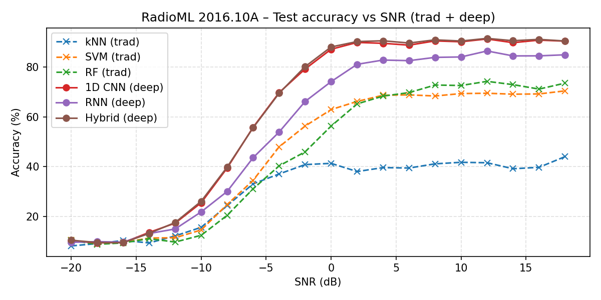

# Tutorial–Automatic–Modulation–Classification

  

# Tutorial–Automatic–Modulation–Classification

This project presents the development and evaluation of machine learning models
for identification of radio–frequency (RF) signals, with a focus on  
**Automatic Modulation Classification (AMC)** using the RadioML 2016.10A
dataset.

The repo is organized as a **walk-through tutorial**:

1. Start from data loading and basic visualizations.
2. Build traditional ML baselines (kNN, SVM, Random Forest).
3. Move to deep learning models (1D CNN and RNN).
4. Finish with a **hybrid CNN/RNN ensemble** and a unified comparison of all
   models on a common train/validation/test split.

All main experiments are implemented as Jupyter notebooks under
[`notebooks/`](notebooks/); code-only variants and utilities live under
[`src/`](src/).

---

## Repository layout

- `notebooks/` – main tutorial notebooks
  - Data loading and visualization
  - Traditional ML baselines for AMC
  - 1D CNN ablation study and final CNN model
  - RNN ablation study and final RNN model
  - Hybrid CNN/RNN ensemble and final model comparison
- `src/` – reusable Python modules and code-only scripts
  - Dataset helpers, model definitions, training/eval utilities,
    and the final comparison script
- `data/`
  - `final_model_charts/` – precomputed figures and tables for the final results
    - `snr_curves_2016.png` – accuracy vs SNR for all models (shown below)
    - `accuracy_bar_2016_70-15-15.png` – overall test accuracy bar chart
    - `cm_*.png` – confusion matrices for CNN, RNN, and Hybrid
    - `final_accuracies_2016_70-15-15.csv` – final accuracy table
  - other subfolders used by the notebooks (e.g., traditional model summaries,
    RNN results)
- `images/` – supporting images/figures used in the notebooks or README
- `tests/` – basic unit tests for core utilities

---

## Data: RadioML 2016.10A

The notebooks assume access to the **RadioML 2016.10A** dataset in a
Python-friendly format (typically a single `.pkl` file mapping
`(modulation, SNR) → ndarray` of shape `(N, 2, 128)`).

Because of licensing and file size, the dataset itself is **not**
included in this repo.

To reproduce the experiments:

1. Download RadioML 2016.10A from its original source or a mirrored dataset
   host (e.g., the DeepSig/RML repository or Kaggle).
2. Convert or save it as a pickle file if needed.
3. Place the file in your own Google Drive or local `data/` folder.
4. Update the dataset path in the notebooks (look for variables such as
   `DATASET_PATH`).

Each notebook calls out the expected dataset path near the top.

---
